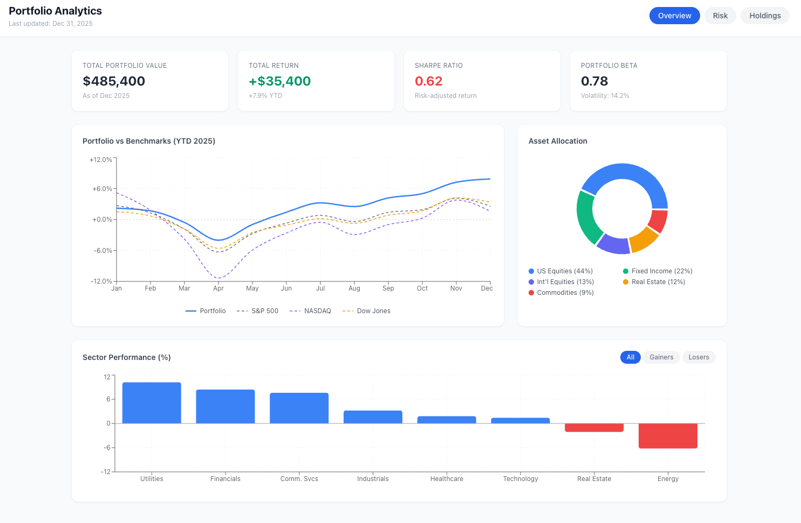
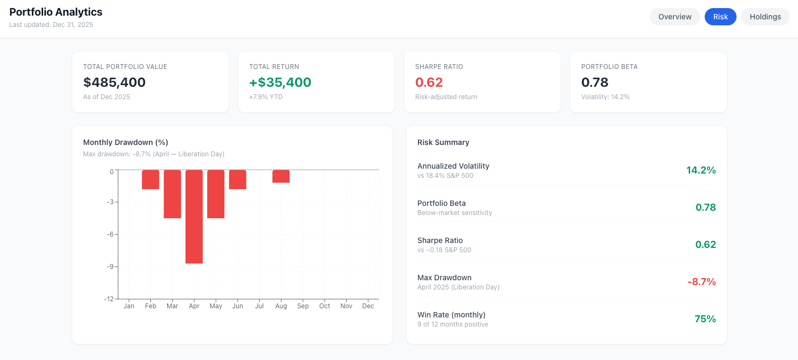
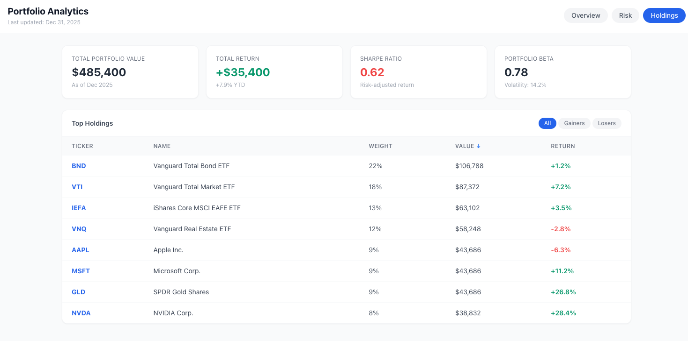

# Portfolio Analytics Dashboard

A responsive investment portfolio dashboard built with React 19, TypeScript, and Tailwind CSS. Tracks 2025 full-year performance against three major US indices with interactive charts, filtering, and sorting. Live market data is sourced from Yahoo Finance via a local Node.js proxy server.





## Features

- **Multi-tab layout** — Overview, Risk, and Holdings views
- **Live market data** — Real-time quotes and historical prices via Yahoo Finance
- **Three benchmark comparisons** — Portfolio vs S&P 500, NASDAQ, and Dow Jones (YTD line chart)
- **Interactive sector chart** — Filter by All / Gainers / Losers; Y-axis auto-scales per filter (gainers start from 0, losers end at 0)
- **Sortable holdings table** — Click any column header to sort; filter by gainers/losers
- **Graceful degradation** — Shows a setup prompt (no crash) when `VITE_API_BASE` is not configured; partial data (e.g. missing sector or history) renders without breaking the layout
- **Error boundary** — Class-based React error boundary catches unexpected render errors

## Tech Stack

| Category | Library / Tool |
|----------|---------------|
| UI Framework | React 19 + TypeScript |
| Styling | Tailwind CSS v3 |
| Charts | Recharts |
| Data Fetching | TanStack React Query v5 |
| Routing | React Router v7 |
| Bundler | Vite 7 |
| Tests | Vitest + Testing Library |
| Backend | Node.js + Express + yahoo-finance2 v3 |

## Project Structure

```
├── src/
│   ├── api/
│   │   └── yahoo.ts            # HTTP client for the local proxy server
│   ├── components/
│   │   ├── CustomTooltip.tsx   # Typed recharts tooltip
│   │   ├── ErrorBoundary.tsx   # Class-based error boundary
│   │   ├── HoldingsTab.tsx     # Sortable + filterable holdings table
│   │   ├── KPICard.tsx         # Reusable KPI card
│   │   ├── OverviewTab.tsx     # Line / pie / bar charts with sector filter
│   │   ├── RiskTab.tsx         # Drawdown chart + risk summary
│   │   └── Skeleton.tsx        # Loading skeleton components
│   ├── hooks/
│   │   └── usePortfolioData.ts # React Query hook — live data + derived metrics
│   └── App.tsx                 # Root layout, routing, error boundary
└── server/
    ├── index.ts                # Express proxy: /api/quotes, /api/price-changes, /api/history
    └── package.json
```

## Getting Started

**Prerequisites:** Node.js 18+

### 1. Install frontend dependencies

```bash
npm install
```

### 2. Start the Yahoo Finance proxy server

```bash
# In a separate terminal
npm run server     # cd server && npm install && npm run dev
```

The server starts at `http://localhost:3001` and exposes three endpoints:

| Endpoint | Description |
|----------|-------------|
| `GET /api/quotes?tickers=BND,VTI,...` | Current price + 1-day change |
| `GET /api/price-changes?tickers=BND,VTI,...` | YTD / 1Y / 6M / 3M / 1M / 5D / 1D returns |
| `GET /api/history?ticker=SPY&from=2024-12-01&to=2025-12-31` | Daily OHLC + adjusted close |

### 3. Configure the frontend

Create `.env.local` in the project root:

```
VITE_API_BASE=http://localhost:3001
```

### 4. Start the frontend

```bash
npm run dev      # http://localhost:5173
```

### Without the proxy server

If `VITE_API_BASE` is not set, the app shows a "Local server not running" setup prompt instead of crashing. No data is fetched and no sample data is shown.

### Other commands

```bash
npm test         # Run unit tests
npm run build    # Production build
```

## Architecture Notes

### Data flow

```
Browser → usePortfolioData (React Query)
        → src/api/yahoo.ts (fetch)
        → localhost:3001 (Express proxy)
        → Yahoo Finance API (yahoo-finance2 v3)
```

### Rate limiting & caching

Yahoo Finance enforces aggressive rate limits. The proxy handles this with:

- **In-memory cache** — quotes: 5 min TTL; historical data: 4 hr TTL
- **Serial request queue** — all Yahoo Finance calls are serialized with an 800 ms gap between requests
- **Automatic retry** — rate-limited requests (429) are retried up to 3 times with exponential backoff

On first page load, all data is fetched serially (~20 s for the full dataset). Subsequent loads within the TTL window are served from cache instantly.

### `usePortfolioData` hook

Orchestrates three parallel React Query calls:
1. `fetchBatchQuotes` — current prices for all holdings
2. `fetchPriceChanges` — multi-period returns for holdings + sector ETFs
3. `fetchHistoricalEOD` — per-holding + benchmark daily history for charts

All derived metrics (portfolio value, YTD return, Sharpe ratio, max drawdown, sector performance) are computed client-side in a single `useMemo`.

### YTD baseline

Historical data is fetched from `2024-12-01` rather than `2025-01-01`. The last trading day of December 2024 is used as the YTD baseline (= 0%), matching standard financial reporting convention.

### Sector chart Y-axis

The Y-axis domain is computed dynamically from the visible data:

- **All** — spans from below the lowest value to above the highest, including 0
- **Gainers** — starts at exactly 0, ends above the highest value
- **Losers** — ends at exactly 0, starts below the lowest value

A 15% padding is added on the open end so bars don't touch the chart edge.

### Sorting + filtering (`HoldingsTab`)

Sort key, sort direction, and filter type are held in local state. The derived `rows` array is computed with a single `useMemo` that chains filter → sort.
